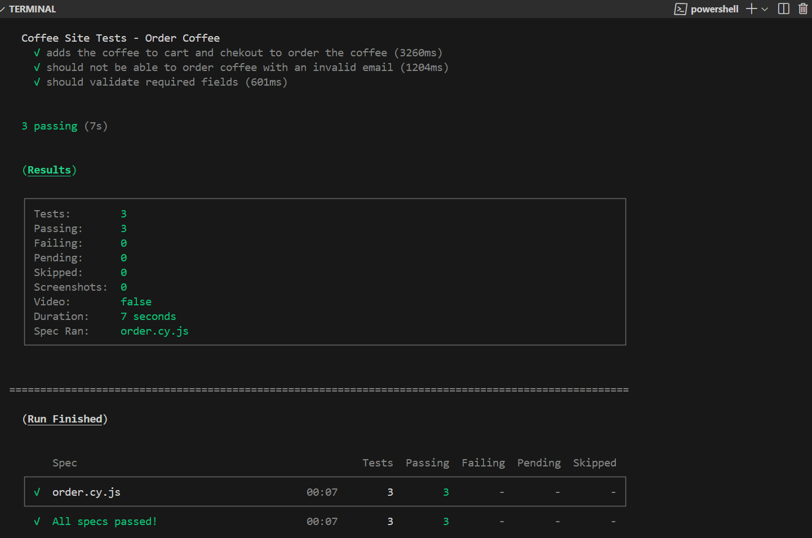
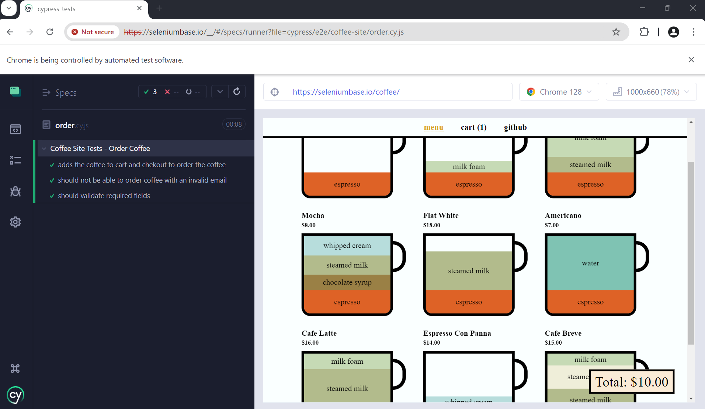

# Cypress End-to-End Automation Tests
This repository contains automated end-to-end (E2E) tests written in JavaScript using the [Cypress testing framework](https://docs.cypress.io/guides/overview/why-cypress).  

The tests are designed to validate the functionalities of the [Saucedemo web application](https://www.saucedemo.com) and [Coffee site](https://seleniumbase.io/coffee/).

# Key Features:

- Tests cover login, product browsing, shopping cart and checkout functionalities
- Utilizes Cypress for efficient and readable UI automation

# Getting Started:

- Clone this repository
- Install dependencies `npm install`
- Run `npm run open` then select 'E2E Testing' and choose your preferred browser   to run the test spec
- Run tests specifying a single test file to run instead of all tests, e.g. `npx cypress run --spec "cypress/e2e/coffee-site/order*"`

# More Info:

- [How to run Cypress from the command line](https://docs.cypress.io/guides/guides/command-line)

- Use [Page Object Model (POM) in Test Automation](https://emerald-software-testing.blogspot.com/2024/08/page-object-model-pom-in-test.html) to maintain the robustness and scalability of test scripts
